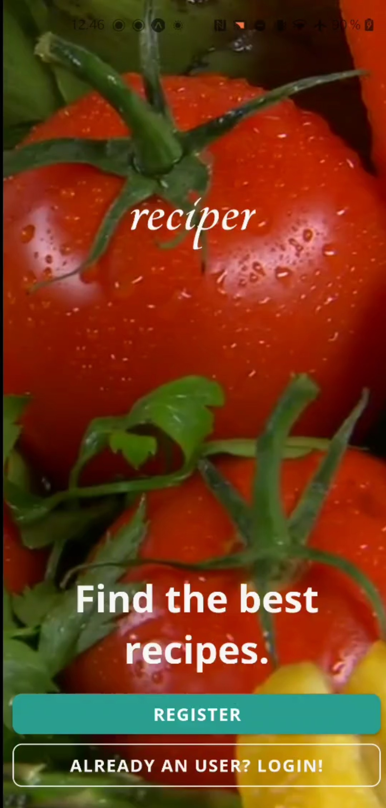

# reciper
Typescript + React Native + GraphQL app. "Tinder for recipes". WIP!

Current phase: backend somewhat done. 
Login and register fully working. Next up TDDing HomeScreen.

Home screen will consist of:
- TopNavBar
- "Tinderish" cards for recipes, that the user can like or dislike

